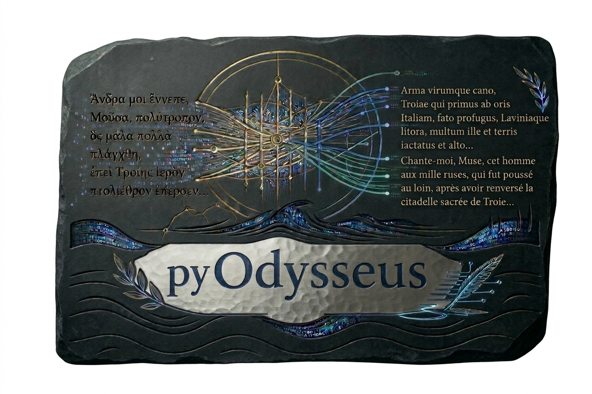

<p align="center">
  
</p>

# pyOdysseus

**Alignement multilingue de textes, édition philologique et comparaison lexicale des traductions**

pyOdysseus est une application locale développée en **Python** et **Streamlit** pour aligner un texte source avec plusieurs traductions, examiner les correspondances et étudier les choix lexicaux des traducteurs. Le projet s'appuie sur une adaptation de **Bertalign** et sur des modèles de représentations sémantiques (*sentence embeddings*).

L'application a été développée notamment pour l'étude du texte grec ancien de l'*Odyssée* et de ses traductions françaises. Elle peut également servir à d'autres corpus : le choix des modèles d'encodage détermine les langues et les comparaisons possibles.

## Fonctionnalités

- **Plusieurs traductions simultanées :** un texte pivot et un nombre variable de textes cibles au format `.txt`.
- **Segmentation configurable :** sections définies par expression régulière ; segmentation SaT/wtpsplit, par ligne ou par paragraphe.
- **Alignement sémantique :** modèle grec ancien → LaBSE et moteur Bertalign adapté, prenant en charge les correspondances 1→1, 1→N et N→1.
- **Vue synoptique :** comparaison du texte source et de ses traductions dans un tableau multicolonnes, avec regroupements de segments alignés.
- **Relecture et correction :** édition du texte, fusion/scission de blocs, transfert de segments entre blocs et sauvegarde des modifications.
- **Analyse lexicale :** lemmatisation du français avec **Stanza `default_accurate`**, lemmes communs, spécifiques ou partagés, exploration des passages alignés.
- **Recherche de proximités textuelles :** chaînes de lemmes similaires et ordonnées dans des fenêtres locales, avec bonus facultatif lié aux lemmes rares. Le score n'est **pas une probabilité d'emprunt**.
- **Sauvegardes et exports :** projets `.pyodysseus.json`, checkpoints locaux, export synoptique CSV et HTML.

## 1. Prérequis

- **Python 3.11 ou 3.12** (3.12 est la version utilisée dans l'environnement de développement initial ; 3.13/3.14 ne sont pas prévus par cet ensemble de dépendances).
- `git` pour cloner le dépôt, ou possibilité de télécharger son archive ZIP.
- Une connexion Internet pour l'installation et le premier téléchargement des modèles.
- De préférence plusieurs Go de mémoire disponible et de la place sur disque pour PyTorch, LaBSE et les modèles Stanza.

Une carte graphique peut accélérer les calculs, mais l'application peut aussi fonctionner **sur CPU**. Les dispositifs `cpu`, `cuda` (NVIDIA) et `mps` (Apple Silicon, si disponibles) figurent parmi les choix de l'interface.

**Versions importantes des dépendances :**

- `sentence-transformers==5.7.0` pour charger le modèle publié `MOdysseus/SPhilBERTa-LaBSE-Bridge-Ridge` ;
- `stanza==1.15.0` pour l'analyse lexicale ;
- les autres dépendances figurent dans `requirements-app.txt`.

**Attention :** un ancien fichier de dépendances pouvait installer `sentence-transformers==3.2.1`. Cette version ne doit pas remplacer la version 5.7.0 utilisée par le modèle publié.

## 2. Récupération du code

Cloner le dépôt **contenant la version Streamlit** :

```bash
git clone URL_DU_NOUVEAU_DEPOT
cd NOM_DU_DEPOT
```

Ou télécharger **Code → Download ZIP** depuis GitHub et décompresser l'archive.

À la racine du dépôt, vérifier la présence des fichiers et dossiers essentiels :

```text
pyOdysseus/
├── app.py
├── pyodysseus_app/
│   ├── alignment/
│   ├── lexical.py
│   ├── engine.py
│   ├── editor.py
│   └── project.py
├── bertalign_odysseus/
├── requirements-app.txt
├── install.command         # macOS, si fourni
├── launch.command          # macOS, si fourni
├── install_windows.bat     # Windows, si fourni
├── launch_windows.bat      # Windows, si fourni
├── install_linux.sh        # Linux, si fourni
└── launch_linux.sh         # Linux, si fourni
```


## 3. Installation sur macOS

### Installation simplifiée avec les fichiers `.command`

Si `install.command` et `launch.command` sont présents :

1. Installer une version compatible de Python.
2. Dans le Finder, ouvrir le dossier `pyOdysseus`.
3. Double-cliquer sur **`install.command`** pour installer les dépendances dans l'environnement virtuel local `.venv`.
4. Télécharger les ressources Stanza avec la commande indiquée ci-dessous (nécessaire si le script d'installation ne le fait pas déjà).
5. Double-cliquer sur **`launch.command`** pour démarrer l'application.

Si macOS bloque le script au premier lancement, utiliser **clic droit → Ouvrir** ou autoriser son exécution dans les réglages de sécurité.

Si le fichier n'est pas exécutable :

```bash
chmod +x install.command launch.command
```

### Installation manuelle (méthode de secours)

Depuis un Terminal ouvert à la racine du dépôt :

```bash
python3.10 -m venv .venv
source .venv/bin/activate
python -m pip install --upgrade pip
python -m pip install -r requirements-app.txt
```

Adapter `python3.10` en `python3.11` ou `python3.12` si nécessaire.

**Télécharger le modèle français de Stanza** :

```bash
python -c "import stanza; stanza.download('fr', processors='tokenize,mwt,pos,lemma', package='default_accurate')"
```

Lancer ensuite Streamlit :

```bash
python -m streamlit run app.py
```

Les utilisations suivantes peuvent se faire via `launch.command` si celui-ci est présent.

## 4. Installation sur Windows

### Installation avec les scripts fournis

Si le dépôt contient `install_windows.bat` et `launch_windows.bat` :

1. Installer une version de Python compatible en cochant l'option permettant son utilisation depuis le terminal si elle est proposée.
2. Double-cliquer sur **`install_windows.bat`**.
3. Télécharger les modèles Stanza si le script ne l'effectue pas.
4. Double-cliquer sur **`launch_windows.bat`**.

### Installation manuelle (Invite de commandes / CMD)

Ouvrir un terminal dans le dossier du dépôt :

```bat
py -3.10 -m venv .venv
.venv\Scripts\python.exe -m pip install --upgrade pip
.venv\Scripts\python.exe -m pip install -r requirements-app.txt
```

Télécharger le modèle Stanza :

```bat
.venv\Scripts\python.exe -c "import stanza; stanza.download('fr', processors='tokenize,mwt,pos,lemma', package='default_accurate')"
```

Lancer l'application :

```bat
.venv\Scripts\python.exe -m streamlit run app.py
```

Si la commande `py -3.10` ne fonctionne pas, vérifier la version de Python installée avec `py --list` ou `python --version`.

## 5. Installation sur Linux (Ubuntu / distributions similaires)

Si des scripts Linux sont inclus :

```bash
chmod +x install_linux.sh launch_linux.sh
./install_linux.sh
./launch_linux.sh
```

Sinon, effectuer l'installation manuelle :

```bash
python3.10 -m venv .venv
source .venv/bin/activate
python -m pip install --upgrade pip
python -m pip install -r requirements-app.txt
python -c "import stanza; stanza.download('fr', processors='tokenize,mwt,pos,lemma', package='default_accurate')"
python -m streamlit run app.py
```

Sur Ubuntu/Debian, le paquet système `python3-venv` peut être nécessaire si la création de l'environnement virtuel échoue. Selon la distribution, le nom du paquet doit correspondre à la version de Python utilisée.

## 6. Premier lancement et modèles

Lorsque Streamlit démarre, le Terminal affiche l'adresse locale de l'application, généralement :

**http://localhost:8501**

Le navigateur s'ouvre normalement automatiquement ; sinon, ouvrir cette adresse.

L'application utilise par défaut :

| Usage | Modèle / méthode |
|---|---|
| Encodage du grec ancien | [`MOdysseus/SPhilBERTa-LaBSE-Bridge-Ridge`](https://huggingface.co/MOdysseus/SPhilBERTa-LaBSE-Bridge-Ridge) |
| Encodage des langues cibles | [`sentence-transformers/LaBSE`](https://huggingface.co/sentence-transformers/LaBSE) |
| Segmentation automatique | SaT / `wtpsplit` (`sat-3l-sm` par défaut dans l'interface) |
| Alignement | Bertalign modifié (`bertalign_odysseus`) |
| Lemmatisation du français | Stanza 1.15.0, `default_accurate` |

Le premier lancement d'un calcul peut être long en raison du **téléchargement des poids des modèles**. Les exécutions suivantes utilisent normalement les caches locaux de Hugging Face et des bibliothèques concernées.

LaBSE et le pont SPhilBERTa–LaBSE produisent des représentations qui peuvent être comparées dans un espace commun ; cela ne garantit pas une qualité équivalente pour toutes les langues, tous les genres ou toutes les traductions. Les résultats doivent être évalués sur les corpus étudiés.

## 7. Utilisation de l'application

### A. Créer un projet

Dans l'onglet **Projet** :

1. Indiquer le nom du projet.
2. Déposer **un fichier `.txt` pivot** (par exemple le grec de l'*Odyssée*).
3. Ajouter **un ou plusieurs fichiers `.txt` cibles** (traductions).
4. Cliquer sur **Créer le projet**.

Les fichiers doivent être enregistrés de préférence en **UTF-8**. Utiliser des noms de fichiers distincts. L'application permet également d'ouvrir un projet `.pyodysseus.json` déjà sauvegardé.

### B. Segmenter et aligner

Dans l'onglet **Alignement** :

1. Définir le découpage en sections. L'expression régulière proposée par défaut est `^(Chant\s*\d+)`, adaptée à des en-têtes comme `Chant1` ou `Chant 1` en début de ligne.
2. Choisir la segmentation du pivot et des cibles : SaT/wtpsplit, une ligne par segment ou paragraphes.
3. Conserver, pour l'alignement grec ancien → langues modernes, le mode **Pont grec ancien → LaBSE (recommandé)**.
4. Choisir le dispositif de calcul (`auto`, `cpu`, `cuda`, `mps`), la taille des lots et, si nécessaire, les paramètres avancés Bertalign.
5. Examiner l'aperçu de segmentation puis lancer l'alignement.

Le traitement produit des correspondances 1→1, 1→N ou N→1. Leur qualité dépend notamment de la segmentation, de la liberté des traductions et du modèle utilisé.

### C. Relire et corriger

Dans **Relecture, correction et analyse** :

- consulter le tableau synoptique source/traductions ;
- corriger le texte des segments ;
- modifier les correspondances par ajout ou transfert de segments ;
- fusionner ou scinder des blocs d'alignement ;
- sauvegarder le projet contenant les corrections.

L'application conserve un historique des modifications dans le projet JSON et écrit aussi des checkpoints locaux.

### D. Explorer les choix lexicaux

L'analyse lexicale est destinée aux traductions françaises. Elle permet notamment d'étudier :

- les lemmes communs, presque communs ou spécifiques ;
- les choix lexicaux dans une fenêtre de segments alignés ;
- les proximités textuelles entre deux traducteurs, mesurées principalement par la **continuité des chaînes de lemmes**, complétée éventuellement par un **bonus de rareté**.

Le score de proximité est **heuristique** : il ne représente ni une probabilité de plagiat ni une preuve de dépendance. Une comparaison philologique du grec, des traductions et de leur chronologie demeure nécessaire.

## 8. Sauvegardes, index et fichiers locaux

### Projets et checkpoints

L'application peut exporter un projet complet :

```text
mon_projet.pyodysseus.json
```

Elle crée aussi des checkpoints locaux, notamment après les sections terminées et les corrections :

```text
pyOdysseus/.pyodysseus_projects/
```

Ces fichiers permettent de reprendre le travail sans devoir réaligner systématiquement les sections déjà enregistrées. **Conserver une copie de sauvegarde des projets JSON**, notamment avant une mise à jour.

### Index lexical persistant

La lemmatisation Stanza peut être coûteuse. Depuis la V3.8.4, les annotations des segments sont conservées dans une base **SQLite** :

```text
~/.cache/pyodysseus/stanza_french_lexical.sqlite3
```

Les analyses ultérieures réutilisent les annotations déjà calculées, même après fermeture de Streamlit. Une modification du texte entraîne un nouveau calcul des annotations concernées. Le premier traitement lexical d'un corpus non encore indexé peut donc être sensiblement plus long que les consultations suivantes.

**Ne pas supprimer cet index pour résoudre un simple ralentissement :** cela forcerait une nouvelle lemmatisation des textes.

### Exports

La vue de relecture propose notamment les exports :

- `CSV synoptique` ;
- `HTML synoptique` ;
- `Projet complet JSON`.

## 9. Mise à jour de l'application

Avant toute mise à jour :

1. Fermer Streamlit et les processus Python associés.
2. Copier les projets `.pyodysseus.json` dans un dossier de sauvegarde.
3. Conserver une copie de la version fonctionnelle de `app.py` et de `pyodysseus_app/`.
4. Mettre à jour le code, **sans supprimer `.venv` ni l'index SQLite**.
5. Si `requirements-app.txt` a changé, réinstaller les dépendances depuis le même environnement virtuel.
6. Redémarrer avec le lanceur habituel.

Pour une simple mise à jour du code Python sans nouvelle dépendance, il n'est généralement **pas nécessaire de réinstaller tout l'environnement**.

## 10. Dépannage

### `ModuleNotFoundError: No module named 'stanza'`

Stanza n'est pas installé dans l'environnement Python utilisé par Streamlit. Depuis la racine du dépôt :

```bash
.venv/bin/python -m pip install 'stanza==1.15.0'      # macOS / Linux
```

Sous Windows (CMD), utiliser `.venv\Scripts\python.exe` à la place de `.venv/bin/python`.

### Modèles Stanza introuvables

Installer les ressources françaises dans le même environnement que l'application :

```bash
.venv/bin/python -c "import stanza; stanza.download('fr', processors='tokenize,mwt,pos,lemma', package='default_accurate')"
```

### `No module named 'sentence_transformers.base'`

Cette erreur peut apparaître lorsqu'un modèle créé avec Sentence Transformers 5.x est chargé par une ancienne version 3.x. Vérifier puis corriger la version :

```bash
.venv/bin/python -m pip install 'sentence-transformers==5.7.0'
.venv/bin/python -c "import sentence_transformers; print(sentence_transformers.__version__)"
```


### Streamlit s'ouvre, mais l'analyse lexicale est lente

- La première annotation du corpus par Stanza `default_accurate` peut être longue sur CPU.
- Vérifier si le premier calcul est réellement terminé avant de relancer une autre analyse.
- Les consultations suivantes doivent normalement bénéficier de l'index SQLite persistant.
- Vérifier que le répertoire `~/.cache/pyodysseus/` est accessible en écriture et que le cache n'est pas effacé à chaque lancement.

### Le navigateur ne s'ouvre pas

Ouvrir manuellement **http://localhost:8501** après avoir lancé Streamlit. Si le port est déjà utilisé, Streamlit peut proposer une autre adresse dans le Terminal.


## 11. Références et crédits

- **Bertalign** — Liu, L., & Zhu, M. (2023). *Bertalign: Improved word embedding-based sentence alignment for Chinese–English parallel corpora of literary texts*. *Digital Scholarship in the Humanities*. https://doi.org/10.1093/llc/fqac089
- **LaBSE** — Feng, F., Yang, Y., Cer, D., Arivazhagan, N., & Wang, W. (2022). *Language-agnostic BERT sentence embedding*. https://doi.org/10.18653/v1/2022.acl-long.62
- **Stanza** — Qi, P., Zhang, Y., Zhang, Y., Bolton, J., & Manning, C. D. (2020). *Stanza: A Python natural language processing toolkit for many human languages*. https://doi.org/10.18653/v1/2020.acl-demos.14
- **Ridge** — Hoerl, A. E., & Kennard, R. W. (1970). *Ridge regression: Biased estimation for nonorthogonal problems*. *Technometrics, 12*(1), 55–67. https://doi.org/10.1080/00401706.1970.10488634

**Projet et développement :** Marianne Reboul, ENS de Lyon — IHRIM (UMR 5317).

**Modèle de projection publié :** https://huggingface.co/MOdysseus/SPhilBERTa-LaBSE-Bridge-Ridge

**Licence :** préciser dans le nouveau dépôt la licence effectivement retenue et conserver les mentions de licence/attribution des composants tiers (notamment la version modifiée de Bertalign). Le dépôt historique `OdysseusPolymetis/pyOdysseus` est publié sous GPL-3.0.
